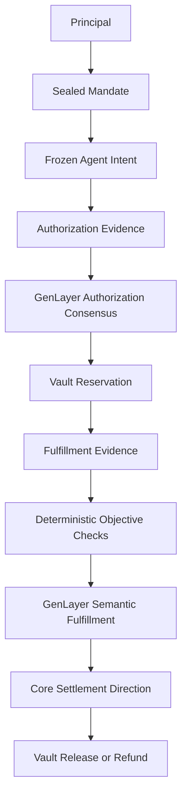
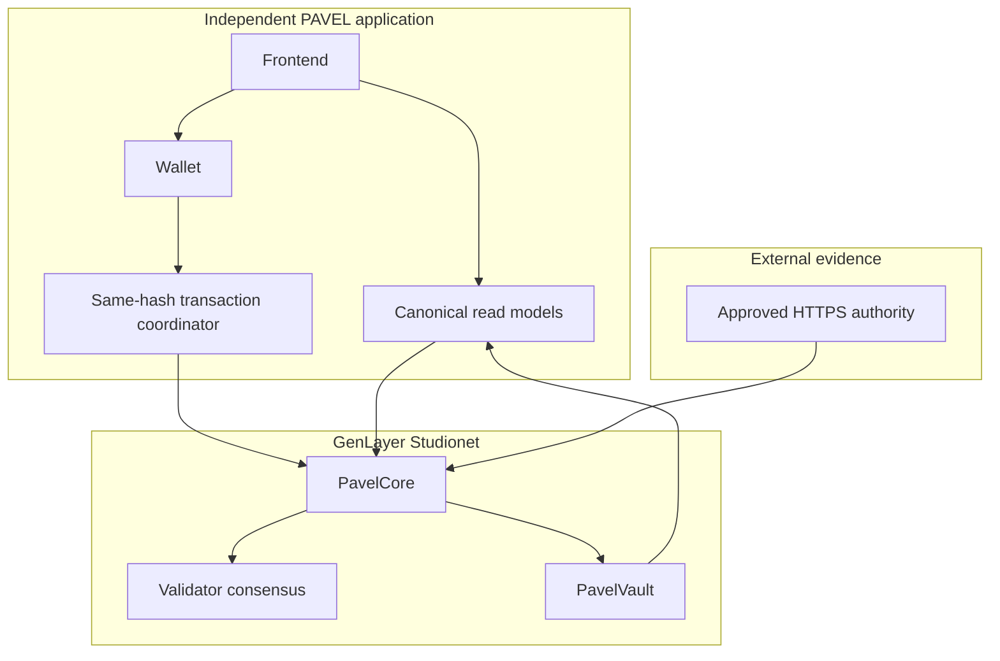

<h1 align="center">PAVEL</h1>

<p align="center"><strong>Policy-Governed Autonomous Value Execution</strong></p>

<p align="center">Bounded agent authority. Authenticated evidence. Validator consensus. Deterministic custody and settlement.</p>

<p align="center">
  <a href="https://pavel-nine.vercel.app">Live App</a> ·
  <a href="docs/ARCHITECTURE.md">Architecture</a> ·
  <a href="docs/DEPLOYMENT.md">Deployment</a> ·
  <a href="docs/QUALIFICATION.md">Qualification</a> ·
  <a href="SECURITY.md">Security</a>
</p>

## What PAVEL is

PAVEL is a GenLayer application for policy-bounded agent authority,
authenticated evidence, deterministic GEN custody, and settlement-aware
fulfillment. A principal seals a Mandate, an authorized agent submits a frozen
Intent, and the protocol coordinates semantic review only where a question
cannot be reduced to deterministic contract facts.

PAVEL is not an unrestricted agent wallet and not an assertion that a model
can decide economic authority by itself. `PavelCore` owns constitutional
policy, identities, evidence, semantic decisions, disputes, and settlement
directions. `PavelVault` owns GEN custody, reservations, conservation
accounting, and Core-directed settlement.

## PAVEL at a glance

| Area | Verified implementation |
| --- | --- |
| Network | GenLayer Studionet |
| Chain ID | `61999` |
| GEN denomination | `1 GEN = 10^18` smallest native units |
| Core | `0xBA2356FfE5062506FA938da4715c03a2BE7929bF` |
| Vault | `0x552167Cc0883D02ce42fA2aD64E29Cd10EE3eDFD` |
| Authorization | `pavel-authorization-v2` |
| Fulfillment | `pavel-fulfillment-v2` |
| Evidence | Authenticated HTTPS snapshots with committed digest and length |
| Deterministic fulfillment | 7 objective checks |
| Semantic fulfillment | 2 bounded boolean fields |
| Maximum fulfillment evidence | 4096 bytes, complete content only |
| Custody | Dedicated `PavelVault` |
| Settlement authority | Core-directed only |
| Failure recovery | Deterministic fulfillment timeout/refund path |
| Transaction safety | Same-hash reconciliation; no blind rebroadcast |
| Hosted lifecycle | PASS |
| Current canonical state | `FULFILLED / RELEASE_PENDING` |
| External transfer | `UNCONFIRMED` |
| Application | <https://pavel-nine.vercel.app> |

## Why PAVEL

Agents can be useful at the boundary between policy and real-world evidence,
but unrestricted model authority is not an acceptable custody model. PAVEL
keeps the high-consequence parts explicit:

- principals seal the policy that constrains an agent;
- counterparty identity, recipient, amount, deliverable, and terms are frozen;
- evidence is authenticated before it can support a decision;
- validators receive a narrow semantic question rather than economic authority;
- Core derives the settlement direction from canonical state; and
- Vault executes only the direction authorized by Core.

The result is a bounded evidence-to-state-transition system rather than a
frontend claim that an AI decision happened.

## Why GenLayer

Traditional contracts are strong at deterministic facts: hashes, lengths,
addresses, amounts, deadlines, state transitions, and replay keys. They are
not designed to independently assess whether authenticated content satisfies
a semantic policy.

GenLayer supplies independent validator execution for those bounded semantic
questions. PAVEL does not use consensus as a substitute for authentication or
contract guards:

| Question | PAVEL authority |
| --- | --- |
| Is the evidence from the permitted authority? | Deterministic Core checks |
| Does the committed digest and byte length match? | Deterministic Core checks |
| Does the semantic content satisfy the locked policy? | GenLayer validator consensus |
| May funds be reserved or settled? | Core/Vault state machine |
| Did an external recipient receive GEN? | Separate external observation boundary |

## Core design principles

| Principle | PAVEL implementation |
| --- | --- |
| Authenticate before judging | HTTPS authority, committed SHA-256, byte length, identity, and snapshot state are checked before semantic review. |
| Keep model authority narrow | Authorization uses twelve booleans; fulfillment uses only two semantic booleans. |
| Keep deterministic facts deterministic | IDs, amounts, URLs, hashes, lengths, authority, quantity, reservation, and settlement direction are not delegated to the LLM. |
| Fail closed | Malformed or unresolved semantic output cannot authorize or settle an Intent. |
| Verify state transitions | A transaction hash and `FINALIZED` status are not application completion; canonical readback is required. |
| Separate custody from policy | Core directs; Vault checks Core and moves accounting exactly once. |
| Preserve recovery | Unresolved fulfillment can reach `FULFILLMENT_EXPIRED` and a deterministic refund direction. |
| Never rebroadcast blindly | The returned transaction hash is persisted and reconciled as the same transaction. |

## How PAVEL works



The active hosted qualification followed the same boundary:

```text
Principal
  ↓
Mandate
  ↓
Agent Intent
  ↓
Authorization Evidence
  ↓
GenLayer Authorization Consensus
  ↓
Vault Reservation
  ↓
Fulfillment Evidence
  ↓
Deterministic Objective Checks
  ↓
GenLayer Semantic Fulfillment
  ↓
Core Settlement Direction
  ↓
Vault Release / Refund
```

Terminal recovery is explicit:

```text
unresolved fulfillment
  → fulfillment deadline
  → FULFILLMENT_EXPIRED
  → REFUND_TO_PRINCIPAL
```

## Trust model

PAVEL separates evidence, judgment, policy, custody, presentation, and
transport.

| Component | Authority | What it cannot decide |
| --- | --- | --- |
| Principal | Creates and seals policy within the protocol bounds | Cannot bypass immutable Mandate constraints after sealing |
| Agent | Creates the permitted Intent and supplies evidence | Cannot choose values outside the Mandate or authorize its own settlement |
| Counterparty | Identifies the approved provider/authority relationship | Cannot redefine recipient, amount, or Core policy |
| Evidence source | Publishes retrievable source material | Cannot authenticate itself or authorize a state transition |
| PavelCore | Stores policy, evidence identity, semantic results, and settlement directions | Does not independently hold the authoritative Vault balance |
| GenLayer validators | Assess the bounded semantic fields | Cannot choose recipients, principals, amounts, IDs, deadlines, or Vault addresses |
| PavelVault | Holds GEN, reserves funds, and executes Core directions | Cannot independently choose release/refund direction or recipient |
| Frontend | Presents reads and prepares user-approved transactions | Is not protocol truth and cannot fabricate state |
| Wallet | Approves a user transaction | Does not decide policy or semantic outcome |
| Transaction transport | Delivers a signed transaction and exposes its hash/status | Does not make an ambiguous broadcast safe to repeat |

`FINALIZED` is a transport/finality result. Application success requires the
execution result and a canonical state postcondition. External settlement is a
separate observation boundary.

## Mandates and agent authority

A principal creates and configures a Mandate, binds approved evidence
authorities, and seals it. Sealing freezes the policy fingerprint and its
limits. A registered agent can then create and submit an Intent only within
those bounds.

The Intent freezes the recipient, amount, counterparty identity, deliverable,
terms, evidence policy, and expiry at submission. `SUBMITTED`,
`EVIDENCE_READY`, and pending semantic states are not approval states.

## Evidence model

Evidence identity is separate from transport. A definition binds the evidence
ID, kind, Mandate/Intent, authority, expected SHA-256, expected byte length,
sequence, and policy context. A bounded remote capture produces an immutable
snapshot only after deterministic validation.

Evidence is untrusted data. Prompt-injection text, fake JSON, instructions to
change an ID, or claims that contradict committed identity do not redefine
protocol facts. Recovery may restore availability only when the committed
identity, authority, digest, length, and bindings still match.

Authorization evidence may use a bounded excerpt where the contract permits
it. V7 fulfillment is stricter: accepted fulfillment evidence is complete and
must be no larger than 4096 bytes. There is no silent prefix truncation.

## Authorization

`pavel-authorization-v2` contains exactly thirteen keys: the schema name and
twelve JSON booleans. The semantic fields cover purpose, activity, prohibited
activity, counterparty scope, deliverable scope, commercial terms, evidence
sufficiency, duplicate purchase, authority scope, fulfillment terms, external
dependencies, and constitutional satisfaction.

Validators compare only the twelve decision-bearing booleans. No explanation,
confidence, identifier, timestamp, or model metadata participates in
consensus. Core deterministically stores the vector and derives:

- `AUTHORIZED` when every field is `true`;
- `REJECTED` with ordered `failed_checks` when any field is `false`; or
- a retry-required state when semantic consensus is malformed or unresolved.

Authorization success alone does not reserve funds.

## Fulfillment

V7 fulfillment separates objective facts from semantic judgment.

The seven objective checks are derived deterministically from canonical state:

1. authorized deliverable identified;
2. provider identity consistent;
3. evidence authentic;
4. delivery corresponds to the Intent;
5. quantity consistent;
6. no material substitution; and
7. Mandate requirements preserved.

The only consensus-critical semantic fields are the two booleans in the exact
three-key `pavel-fulfillment-v2` object:

```json
{
  "schema": "pavel-fulfillment-v2",
  "material_terms_satisfied": true,
  "completion_evidence_sufficient": true
}
```

`FULFILLED` requires every objective check and both semantic fields to pass.
Definitive failure produces `NOT_FULFILLED` and a refund direction. Malformed
or unresolved semantic evaluation fails closed and remains recoverable through
the deterministic fulfillment deadline path.

## Settlement and custody

`PavelVault` maintains conserved accounting:

```text
available + reserved + release_pending + refund_pending + recovered = deposited
```

Reservation reads Core's canonical authorization and frozen economic values.
After fulfillment, Core issues one direction such as release to the approved
counterparty or refund to the principal. Vault accepts only that direction,
uses a namespaced settlement ID, and rejects duplicate release/refund paths.

The verified V7 lifecycle is `FULFILLED / RELEASE_PENDING`. That means a
Core-directed external release request exists and accounting is conserved. It
does not mean an external transfer has been independently observed as paid.

## Architecture



The Core/Vault binding is one-time and bidirectional. Core reads Vault
reservation/accounting views; Vault reads Core authorization and settlement
directions. A frontend configuration value never replaces those canonical
readbacks.

## Transaction safety

Every consequential write follows:

```text
PRECONDITION READ
  → NETWORK CHECK
  → BROADCAST ONCE
  → PERSIST HASH IMMEDIATELY
  → RECONCILE SAME HASH
  → FINALITY
  → EXECUTION RESULT
  → LATEST_FINAL READBACK
```

Once a transaction hash exists, a timeout or RPC interruption is an
observation problem, not permission to rebroadcast. Checkpoints distinguish a
transaction hash from a completed business postcondition.

## Verified V7 deployment

| Field | Value |
| --- | --- |
| Network | Studionet |
| Chain ID | `61999` |
| RPC | `https://studio.genlayer.com/api` |
| Core | `0xBA2356FfE5062506FA938da4715c03a2BE7929bF` |
| Vault | `0x552167Cc0883D02ce42fA2aD64E29Cd10EE3eDFD` |
| Core SHA-256 | `4acc04c4b684b35058b793973eec75569af9e981eb84d33167198615255b785a` |
| Vault SHA-256 | `f671005e07a658a17a7711807d23fa56bf0d6e2e85d0a266eafc17b03455f15c` |
| Authorization schema | `pavel-authorization-v2` |
| Fulfillment schema | `pavel-fulfillment-v2` |
| Core/Vault binding | Verified bidirectionally |
| Mandate | `SEALED` |
| Authorization | Canonical `AUTHORIZED` |
| Reservation | Canonical reservation and release transition |
| Fulfillment | Canonical `FULFILLED` |
| Settlement | `RELEASE_PENDING` |
| Accounting | Conserved |
| External settlement | `UNCONFIRMED` |

V5 and V6 deployments remain immutable audit history. They are not runtime
defaults and their balances are not counted as V7 accounting.

## End-to-end qualification

The verified hosted V7 lifecycle covered fresh deployment and binding,
principal/agent/counterparty registration, Mandate sealing, deposit, Intent
creation, authenticated authorization evidence, authorization consensus,
reservation, complete fulfillment evidence, deterministic objective checks,
semantic fulfillment, Core settlement direction, and Vault accounting
readback.

The release gates include:

| Gate | Result |
| --- | --- |
| Full Python suite | `168 passed, 1 expected skip` |
| Full Node suite | `111 passed` |
| V7 direct tests | `PASS` |
| Property tests | `PASS` |
| Mutation tests | `PASS` |
| GenVM lint / validation / schema / typecheck | `PASS` |
| Full Node qualification gate | `111 passed` |
| Frontend tests | `77 passed` |
| Typecheck / lint / build | `PASS` |
| Network guard | `PASS` |
| Secret scan | `PASS` |
| Source parity | `PASS` |
| Canonical read smoke | `PASS` |
| Browser E2E | `15 passed` — desktop 1440px, mobile 430px, mobile 390px |

Browser E2E is a real production Playwright audit. It runs against the built
Next.js server and covers the 1440px desktop, 430px mobile, and 390px mobile
layouts, with screenshots and traces uploaded by CI.

## Security properties

- deterministic identity, amounts, budgets, recipients, deadlines, hashes,
  lengths, and settlement directions cannot be selected by validator prose;
- malformed semantic output cannot create an authorization or fulfillment;
- objective fulfillment contradictions fail deterministically;
- complete fulfillment content is required within the explicit 4096-byte bound;
- Core controls release/refund direction and Vault enforces it;
- release and refund are mutually exclusive and replay-protected;
- unresolved fulfillment has a bounded timeout/refund recovery path;
- evidence is append-only, identity-bound, and injection-delimited; and
- the frontend cannot claim payment completion from parent transaction finality.

See [`SECURITY.md`](SECURITY.md), [`docs/SECURITY_INVARIANTS.md`](docs/SECURITY_INVARIANTS.md),
and [`docs/EVIDENCE_MODEL.md`](docs/EVIDENCE_MODEL.md).

## Application

The independent PAVEL application is available at
<https://pavel-nine.vercel.app>. Public pages include:

| Route | Purpose |
| --- | --- |
| `/` | PAVEL landing page |
| `/app` | Protocol overview and current network |
| `/app/proof` | Deployment, source, lifecycle, and proof status |
| `/app/intents` | Intent read model |
| `/app/mandates` | Mandate read model |
| `/app/vault` | Vault accounting and custody state |
| `/app/evidence` | Evidence identity and authentication state |
| `/app/activity` | Reconciled transaction activity |
| `/app/security` | Trust and security boundaries |
| `/integrate` | Integration context |

The application is an independent PAVEL deployment with its own repository,
runtime configuration, and production project.

## Technology

| Protocol | Application | Verification |
| --- | --- | --- |
| GenLayer intelligent contracts | Next.js / React | Python Direct Mode |
| Python contract code | TypeScript | `genlayer-js` |
| `pavel_core.py` / `pavel_vault.py` | Zod read models | Vitest |
| `pavel-authorization-v2` | Next.js App Router | GenVM lint |
| `pavel-fulfillment-v2` | Studionet RPC client | Network and secret guards |

## Verification and testing

Run the deterministic release checks from the repository root:

```powershell
$env:GENVM_VERSION='v0.2.16'
pnpm test
node scripts/run-node-qualification.mjs
pnpm contracts:compile
pnpm contracts:lint
pnpm --dir frontend test
pnpm --dir frontend typecheck
pnpm --dir frontend lint
pnpm --dir frontend build
pnpm network:guard
powershell -NoProfile -ExecutionPolicy Bypass -File scripts/secret-scan.ps1
node tools/qualification/validate-manifest.mjs
python scripts/validate-deployment-manifest.py
python scripts/validate-qualification-v2.py
python scripts/validate-qualification-v7.py
```

These checks do not submit chain transactions. Hosted qualification is a
separate controlled process with persisted transaction hashes and canonical
readback.

## Repository structure

```text
PAVEL/
├── contracts/          # PavelCore and PavelVault intelligent contracts
├── deployments/        # Active V7 manifest and historical deployment records
├── docs/               # Architecture, protocol, deployment, security, and release docs
├── evidence/            # Evidence directory conventions and provenance pointers
├── frontend/            # Independent PAVEL Next.js application
├── scripts/             # Qualification, validation, and safety gates
├── tests/               # Direct, integration, property, adversarial, and lifecycle tests
├── tools/               # Manifest and qualification utilities
├── .env.example         # Public network/address defaults only
├── PROVENANCE.md        # Current release and historical qualification record
├── SECURITY.md          # Security posture and trust boundaries
└── README.md            # This overview
```

## Local development

### Prerequisites

- Node.js `24.14.0` or compatible pinned project runtime;
- pnpm `11.0.9`;
- Python `3.14` with the pinned Direct Mode dependencies; and
- a browser wallet only for explicitly approved write flows.

Install dependencies and start the read-oriented frontend:

```powershell
pnpm install
pnpm --dir frontend install
pnpm --dir frontend dev
```

Public reads do not require a wallet. Never place private keys, keystore
passwords, seed phrases, or API tokens in `.env.example` or tracked files.

## Verify PAVEL in 5 minutes

1. Open <https://pavel-nine.vercel.app> and confirm the PAVEL branding.
2. Open `/app/proof` and verify Studionet `61999`, the V7 Core/Vault addresses,
   and the two source hashes.
3. Confirm authorization is `pavel-authorization-v2` and canonical.
4. Confirm fulfillment is `pavel-fulfillment-v2` with seven objective checks
   and two semantic booleans.
5. Confirm the current settlement is `RELEASE_PENDING`, accounting is
   conserved, and external settlement is explicitly `UNCONFIRMED`.
6. Review [`deployments/studionet/manifest.json`](deployments/studionet/manifest.json),
   [`docs/QUALIFICATION.md`](docs/QUALIFICATION.md), and
   [`PROVENANCE.md`](PROVENANCE.md).
7. Run the local validation commands above for source and repository checks.

## Limitations

- Studionet is a hosted qualification environment, not a claim of independent
  production security audit.
- `RELEASE_PENDING` proves a Core-directed external release request and
  conserved internal accounting; it does not prove an external credit.
- Evidence can be unavailable, stale, or semantically insufficient. PAVEL is
  designed to fail closed in those cases.
- Validator consensus is bounded by the locked schema and evidence supplied;
  it is not a general-purpose oracle.
- Browser E2E is enforced in CI at 1440px desktop, 430px mobile, and 390px
  mobile widths; HTTP route smoke and canonical read smoke remain additional
  checks.

## Current status

PAVEL V7 is the active source-verified release:

```text
Network: Studionet 61999
Authorization: AUTHORIZED
Fulfillment: FULFILLED
Settlement: RELEASE_PENDING
Accounting: CONSERVED
External settlement: UNCONFIRMED
```

V1–V6 are preserved as historical qualification records only. The current
source, deployment manifest, GitHub repository, and independent live
application describe the PAVEL V7 release.
