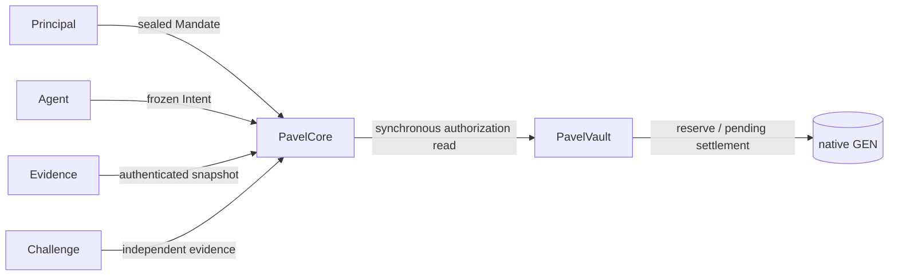

# PAVEL

PAVEL (Policy-governed Autonomous Value Execution Layer) is protocol
infrastructure for constitutional agent authority, deterministic GEN custody,
evidence authentication, fulfillment adjudication, and dispute-aware
settlement. It is designed for a principal who wants an agent to act within a
sealed policy, not to receive an unrestricted withdrawal capability.

The two authoritative Intelligent Contracts are deliberately separated:

- `contracts/pavel_core.py` owns principals, agents, Mandates, delegation,
  frozen Intents, evidence identity and snapshots, semantic decisions,
  disputes, and deterministic settlement instructions.
- `contracts/pavel_vault.py` owns payable GEN, reservations, budgets,
  conservation accounting, replay protection, and pending external settlement.

The browser client is chain-state honest. It never presents an unassessed
Intent as approved, persists a returned GenLayer transaction ID before
polling, separates finality from execution success, and does not claim an
external EOA transfer completed merely because its parent transaction
finalized.

Evidence identity is separate from transport: an approved recovery URL may
restore availability only when the exact committed bytes, digest, length,
authority, Intent, Mandate, and policy binding match. Permissionless challenge
records are independent and append-only; only an authenticated qualifying
challenge blocks settlement.

## Local verification

```powershell
$env:GENVM_VERSION='v0.2.16'
\.venv\Scripts\pytest.exe -q
\.venv\Scripts\genvm-lint.exe check contracts\pavel_core.py --json
\.venv\Scripts\genvm-lint.exe check contracts\pavel_vault.py --json
\.venv\Scripts\genvm-lint.exe schema contracts\pavel_core.py --json
\.venv\Scripts\genvm-lint.exe typecheck contracts\pavel_core.py --json
\.venv\Scripts\genvm-lint.exe typecheck contracts\pavel_vault.py --json
node tools/qualification/validate-manifest.mjs
pnpm --dir frontend typecheck
pnpm --dir frontend lint
pnpm --dir frontend build
node scripts/network-guard.mjs
```

GenVM-dependent tests are run serially. A network qualification is separate
from local verification and uses a new versioned artifact directory.

The qualification-v2 Core and corrected Vault have both finalized successfully
and are source verified. The pair is deployed but still unbound; binding and
the economic lifecycle require the next secure signing checkpoint.
Qualification-v1 remains historical failure evidence and is never a runtime
default. No server wallet, database authority, GitHub remote, or public
deployment is configured.

## Canonical network

PAVEL targets stable Studionet: `https://studio.genlayer.com/api`, chain
`61999`, native `GEN`, explorer `https://explorer-studio.genlayer.com`.

## Architecture



Core decides policy and semantic facts; Vault decides deterministic economic
transitions. A Core write does not synchronously write Vault. The protocol uses
pull verification across typed Intelligent Contract views.

## Repository map

`contracts/` contains the authoritative contracts. `tests/` contains Direct
Mode, adversarial, property, and boundary tests. `frontend/` contains the
typed chain client and route shell. `docs/` contains protocol, security,
qualification, release, and provenance records. Qualification artifacts are
versioned below `artifacts/studionet/` and are not canonical configuration.

## Qualification status

The first Vault deployment exposed a live constructor boundary defect:
`Address(Address(...))`. It is preserved as qualification-v1 provenance. The
corrected qualification-v2 Core and Vault are finalized and byte-for-byte
source verified. Binding, funding, and lifecycle qualification still require
the operator's secure manual signing step.

Read [`docs/QUALIFICATION.md`](docs/QUALIFICATION.md),
[`docs/RELEASE_CHECKLIST.md`](docs/RELEASE_CHECKLIST.md), and
[`docs/STEWARD_NOTES.md`](docs/STEWARD_NOTES.md) before any deployment.
